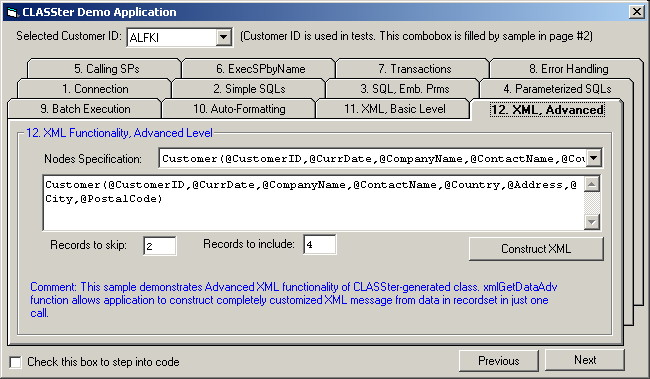

## Automatically generated database access class

### Description

Demo for database access class automatically generated by CLASSter. Full source demonstrates calling stored procedures, executing parameterized SQLs, multiple recordsets, batch execution, transaction control, XML processing, error handling, etc.
 
### More Info
 

             |
---                |---
**Submitted On**   |2002-05-12 11:16:30
**By**             |[URFIN JUS](https://github.com/Planet-Source-Code/PSCIndex/blob/master/ByAuthor/urfin-jus.md)
**Level**          |Advanced
**User Rating**    |5.0 (70 globes from 14 users)
**Compatibility**  |VB 6\.0, VB Script, ASP \(Active Server Pages\) 
**Category**       |[Databases/ Data Access/ DAO/ ADO](https://github.com/Planet-Source-Code/PSCIndex/blob/master/ByCategory/databases-data-access-dao-ado__1-6.md)
**World**          |[Visual Basic](https://github.com/Planet-Source-Code/PSCIndex/blob/master/ByWorld/visual-basic.md)
**Archive File**   |[Automatica822735122002\.zip](https://github.com/Planet-Source-Code/urfin-jus-automatically-generated-database-access-class__1-34725/archive/master.zip)

